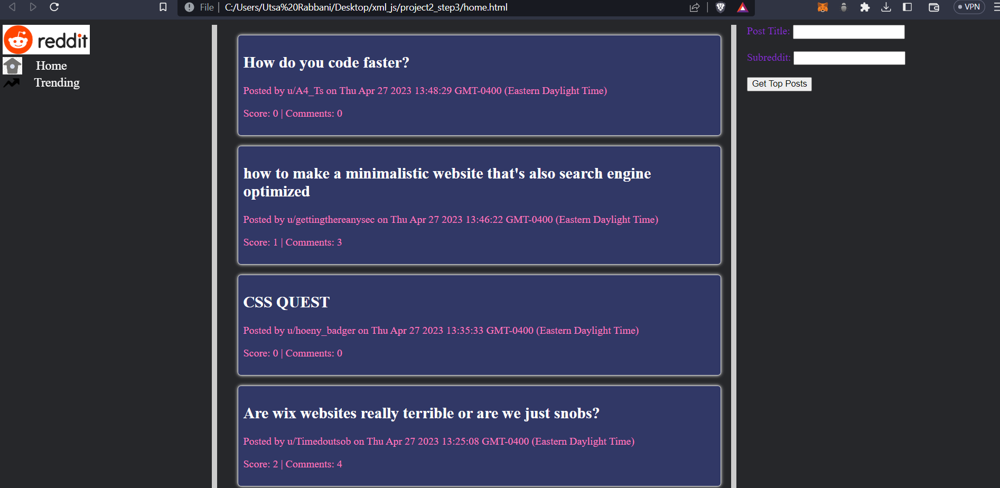
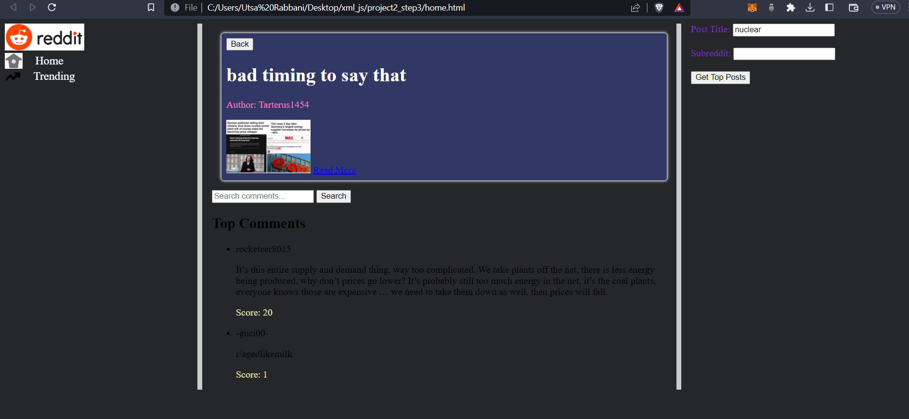
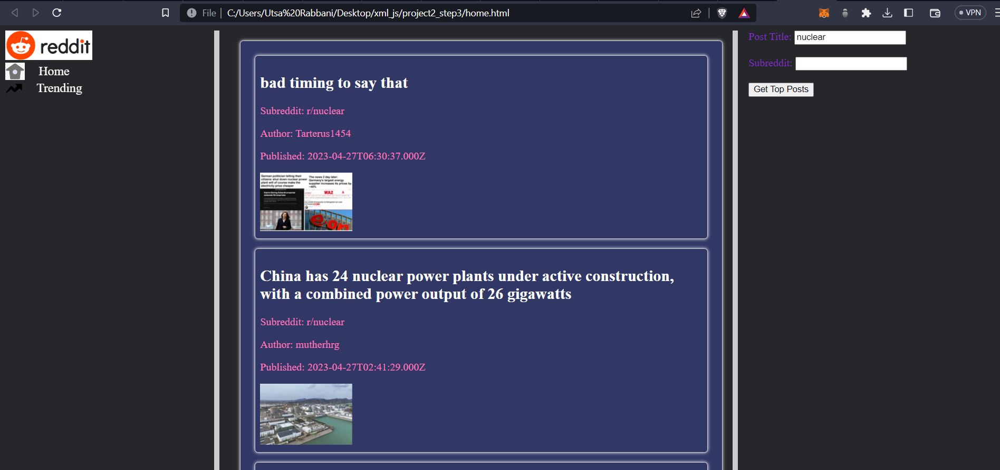

# Reddit Viewer

A single-page application that functions as a Reddit viewer, similar to a Twitter clone. Browse through various subreddits, view trending posts, and enjoy a seamless user experience.

## File Structure

├── css
│   ├── brand.css
│   ├── layout.css
│   ├── main.css
│   └── sidebar_menu.css
├── images
│   ├── home_icon.png
│   ├── reddit-logo.png
│   ├── reddit.png
│   ├── trending_icon.png
│   └── trending_icon.webp
├── js
│   ├── getPosts.js
│   ├── getPostsHome.js
│   └── getPostsTrending.js
├── eachsubreddit.PNG
├── home.html
├── homepage.PNG
└── partialsearch.PNG

## Features

- Browse through various subreddits
- View trending posts
- Search for specific subreddits
- Responsive design

## Usage

1. Open `home.html` in your preferred web browser.
2. Use the sidebar menu to navigate between the homepage and trending posts.
3. Search for specific subreddits using the search bar.

## Screenshots

## Contributing

Feel free to submit pull requests or open issues to improve the project.
The CSS files have been developed by [Vatsal Patel]https:github.com/pvatsalk
